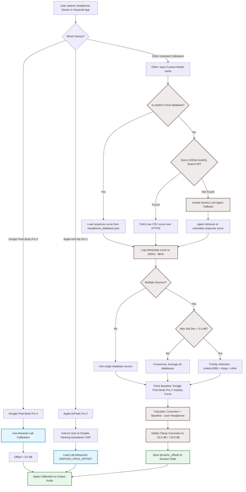

# AFHI Web Demos
Python demos of the hearing tests developed by the AFHI.

A live instance is hosted at [afhi-hearing-tests.streamlit.app](https://afhi-hearing-tests.streamlit.app/).

## Disclaimers
This application contains hearing tests currently being evaluated for equivalence to clinical audiometry. Please read the **Medical & Hardware Disclaimer** in the [LICENSE](LICENSE) file.

## Recommended installation procedure
1. Clone this repository: `git clone <repository-url>`
2. Create a virtual environment: `python -m venv .venv`
3. Activate the environment:
    * `source .venv/bin/activate` (Linux/macOS)
    * `.venv\Scripts\activate` (Windows)
4. Install dependencies: `pip install -r requirements.txt`

## Usage
To run the Streamlit app locally:
`streamlit run web_app.py`

## Feature Control for Different Audiences

Certain features (like the "Email results" option) may be enabled or disabled 
depending on the target audience or deployment environment (e.g., for UX 
research vs. clinical research).

This is controlled using the `APP_TARGET_AUDIENCE` configuration setting, which 
can be set either as a **Streamlit Secret** (for cloud deployments) or an 
**environment variable** (for local testing).

The code reads this setting and adjusts the displayed features accordingly. 
Supported values are:

*   `"UX"`: Enables features specific to UX researchers (currently includes the email results form).
*   `"NAL"`: Disables features not required for clinical researchers (currently hides the email results form).
*   `"ALL"` (Default): If the variable is not set, or set to `"ALL"`, all features will be enabled.

This allows different Streamlit Cloud apps to present slightly different user 
experiences based solely on their configured Secrets, without requiring 
divergent code branches.


## Headphone Calibration System

To deliver accurate hearing tests across different headphone models, the application implements a hybrid calibration strategy. Depending on the selected device, it uses either **absolute lab-measured calibrations**, **fixed relative laboratory offsets**, or a **dynamic best-effort pipeline** that pulls and processes frequency response curves from the web.

### 1. Supported Calibration Methods

#### A. Google Pixel Buds Pro 2 (Baseline Device)
* **Calibration Type**: **Absolute Lab-Measured (Gold Standard)**.
* **Mechanism**: The hearing tests (Hughson-Westlake, Adaptive, and Pip PTA) were designed and empirically validated in a laboratory setting specifically using Google Pixel Buds Pro 2.
* **Implementation**: The baseline mapping between **dB HL** (Hearing Level, clinical threshold) and **dB SPL** (Sound Pressure Level, physical acoustic power) is hardcoded in the `dbhl_to_dbspl` function in `calibration.py`. 
* **Offsets**: No additional offsets are applied (offset = `0.0` dB) because the baseline curves represent absolute physical values for this hardware.

#### B. Apple AirPods Pro 2
* **Calibration Type**: **Fixed Laboratory Offsets**.
* **Mechanism**: The acoustic characteristics of the Apple AirPods Pro 2 were physically measured against the Google Pixel Buds Pro 2 in a controlled laboratory using a professional acoustic coupler and sound level meter.
* **Implementation**: A dedicated, hardcoded dictionary `AIRPODS_PRO2_OFFSET` in `calibration.py` defines a precise correction offset (in dB) for each standard audiometry frequency.
* **Requirement**: For these offsets to remain valid, the user **must** disable all active DSP "Hearing Assistance" or active noise cancellation features (e.g., Conversation Boost, Loud Noise Reduction, Personalized Spatial Audio, or Adaptive Audio) on their AirPods.

#### C. Other (Untested Calibration)
* **Calibration Type**: **Dynamic Best-Effort (AutoEq-Relative)**.
* **Mechanism**: When a user inputs a custom headphone model (e.g., *Sony WH-1000XM4*), the app launches a dynamic data retrieval and processing pipeline to calculate relative calibration offsets against the baseline.
* **Accuracy Notice**: This method is a best-effort approximation. It is **less accurate** than the dedicated laboratory calibrations for the Google Pixel Buds Pro 2 and Apple AirPods Pro 2 because it uses relative database shapes, cannot account for absolute hardware sensitivity/amplifier differences, and is subject to fitting/seal variations.

### 2. The Dynamic Calibration Pipeline (`hearing_agent/calibration_pipeline.py`)

When **Other (Dynamic Calibration)** is selected, the application processes, vets, and matches the headphone's frequency response against baseline standards using a three-step pipeline:

#### Step 1: Logarithmic Frequency Interpolation
This projects a headphone's arbitrary measured frequency response from the database onto standard audiometry frequencies: `[250, 500, 1000, 2000, 3000, 4000, 6000, 8000]` Hz.
* **Logarithmic Scaling**: Since human hearing and frequency response profiles scale logarithmically, linear interpolation on raw Hz values would introduce distortions (especially in high frequencies). Instead, frequencies are transformed into $\log_{10}$ space before interpolating:
  ```python
  log_freqs = np.log10(freqs)
  log_targets = np.log10(target_freqs)
  return np.interp(log_targets, log_freqs, responses)
  ```

#### Step 2: Multi-Database Vetting and Integration
Measurement databases can differ due to measurement fixtures and target curves. The `vet_and_combine_responses` function resolves differences when data is found in multiple databases (e.g., `oratory1990`, `rtings`) from the [AutoEq repo](https://github.com/jaakkopasanen/AutoEq):

##### Authoritativeness and Priorities
If the measurement deviation between databases exceeds the discrepancy threshold (**3.0 dB**), the module prefers databases in this order (configured in [config.py](file:///usr/local/google/home/butterworthnat/HACK/hearing/afhi-hearing-tests-public/hearing_agent/config.py)):
1. `oratory1990` (Most authoritative / professional coupler measurements)
2. `rtings`
3. `other`

#### Step 3: Calibration Correction Calculation
To calibrate the user's headphones, the system computes the difference between the baseline target and the vetted headphone curve:

$$\text{Correction} = \text{Baseline Response} - \text{User Headphone Response}$$

##### Safety Clamping
To protect user hearing and prevent amplifier clipping, the correction factor is capped:
* **Max Gain boost**: $+15.0\text{ dB}$
* **Max Attenuation**: $-15.0\text{ dB}$

If any correction exceeds these limits, it is clipped, and the metadata field `clipping_occurred` is set to `True` along with diagnostic metrics showing the max clipping difference.

### 3. Calibration Architecture & Data Flow

The following diagram illustrates how calibration data is sourced, processed, and applied across all three modes:



### Key Configurations Used

Referenced from `config.py`:

| Parameter | Value | Description |
| :--- | :--- | :--- |
| `AUDIOMETRY_FREQUENCIES` | `[250, 500, 1000, 2000, 3000, 4000, 6000, 8000]` | Frequencies tested in hearing tests. |
| `DATABASE_PRIORITY` | `['oratory1990', 'rtings']` | Authority hierarchy for source databases. |
| `MAX_CORRECTION_DB` | `15.0` | Upper limit for boost correction. |
| `MIN_CORRECTION_DB` | `-15.0` | Lower limit for attenuation correction. |
| `VETTING_DISCREPANCY_THRESHOLD_DB` | `3.0` | Standard deviation threshold for source discrepancy. |


## Contributing

### Development workflow
1. Create a feature branch from `main`.
2. Increment the version number in `common.py`.
3. Run all tests and ensure they pass before opening a pull request.

### Testing
Discover and run all unit tests:\
`pytest`

Aim for 100% coverage with unit tests for new, non-UI code. Use\
`coverage run -m pytest`\
`coverage report -m --omit='*_test.py'`

### Python style
Use pylint:\
`pylint *.py`\
Code should be rated 10/10. Pylint uses the pylintrc file from
[here](https://google.github.io/styleguide/pylintrc) for Google style. This file is included in this repository.\
If there are many pylint issues (e.g., a lot of new code where the indentation is wrong), consider using pyink to first
autoformat with the following options:\
`pyink --pyink-indentation 2  --pyink-use-majority-quotes  <filename>.py'`\
Do not run pyink on code that already passes pylint (it sometimes produces a worse result than human-edited code).

## License
Please see the [LICENSE](LICENSE) file for details on the licensing of this project.

Note: The VCV audio stimuli files in this repository are sourced from the external [qVCV project](https://github.com/BoysTownOrg/qVCV).
