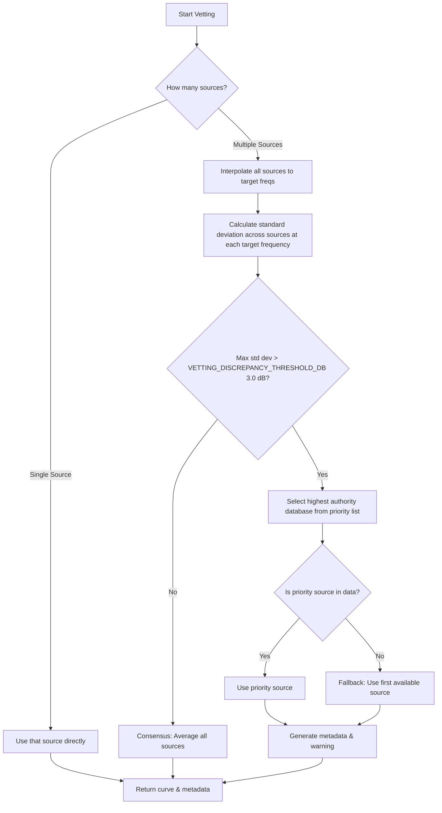

# AFHI Web Demos
Python demos of the hearing tests developed by the AFHI.

A live instance is hosted at [afhi-hearing-tests.streamlit.app](https://afhi-hearing-tests.streamlit.app/).

## Disclaimers
This application contains hearing tests currently being evaluated for equivalence to clinical audiometry. Please read the **Medical & Hardware Disclaimer** in the [LICENSE](LICENSE) file.

## Recommended installation procedure
1. Clone this repository: `git clone <repository-url>`
2. Create a virtual environment: `python -m venv .venv`
3. Activate the environment:
    * `source .venv/bin/activate` (Linux/macOS)
    * `.venv\Scripts\activate` (Windows)
4. Install dependencies: `pip install -r requirements.txt`

## Usage
To run the Streamlit app locally:
`streamlit run web_app.py`

## Feature Control for Different Audiences

Certain features (like the "Email results" option) may be enabled or disabled 
depending on the target audience or deployment environment (e.g., for UX 
research vs. clinical research).

This is controlled using the `APP_TARGET_AUDIENCE` configuration setting, which 
can be set either as a **Streamlit Secret** (for cloud deployments) or an 
**environment variable** (for local testing).

The code reads this setting and adjusts the displayed features accordingly. 
Supported values are:

*   `"UX"`: Enables features specific to UX researchers (currently includes the email results form).
*   `"NAL"`: Disables features not required for clinical researchers (currently hides the email results form).
*   `"ALL"` (Default): If the variable is not set, or set to `"ALL"`, all features will be enabled.

This allows different Streamlit Cloud apps to present slightly different user 
experiences based solely on their configured Secrets, without requiring 
divergent code branches.


## Calibration for alternate Headphones: `hearing_agent/calibration.py`

The calibration module `calibration.py` is responsible for processing, vetting, and matching headphone frequency responses against baseline standards. It converts raw measurement curves into standardized correction offsets across standard audiometry frequencies.

The core pipeline works in three steps:
1. **Interpolation**: Logarithmic interpolation of frequency response curves to standard test frequencies.
2. **Vetting & Integration**: Combining or selecting response curves from multiple source databases (e.g., `oratory1990`, `crinacle`, `rtings`).
3. **Correction Calculation**: Computing safe gain correction factors (in dB) bounded by safety limits.

### 1. Logarithmic Frequency Interpolation

#### `interpolate_response`
This function projects a headphone's arbitrary measured frequency response onto standard audiometry frequencies:
`[250, 500, 1000, 2000, 3000, 4000, 6000, 8000]` Hz.

* **Logarithmic Scaling**: Since human hearing and frequency response profiles scale logarithmically, linear interpolation on raw Hz values would introduce distortions (especially in high frequencies). Instead, frequencies are transformed into $\log_{10}$ space before interpolating:
  ```python
  log_freqs = np.log10(freqs)
  log_targets = np.log10(target_freqs)
  return np.interp(log_targets, log_freqs, responses)
  ```

### 2. Multi-Database Vetting and Integration

#### `vet_and_combine_responses`
Measurement databases can differ due to measurement fixtures and target curves. This function resolves differences when data is found in multiple databases:



#### Authoritativeness and Priorities
If the measurement deviation between databases exceeds the discrepancy threshold (**3.0 dB**), the module prefers databases in this order (configured in [config.py](file:///usr/local/google/home/butterworthnat/HACK/hearing/afhi-hearing-tests-public/hearing_agent/config.py)):
1. `oratory1990` (Most authoritative / professional coupler measurements)
2. `crinacle`
3. `rtings`


### 3. Calibration Correction Calculation

#### `calculate_calibration_correction`
To calibrate the user's headphones, the system computes the difference between the baseline target and the vetted headphone curve:

$$\text{Correction} = \text{Baseline Response} - \text{User Headphone Response}$$

#### Safety Clamping
To protect user hearing and prevent amplifier clipping, the correction factor is capped:
* **Max Gain boost**: $+15.0\text{ dB}$
* **Max Attenuation**: $-15.0\text{ dB}$

If any correction exceeds these limits, it is clipped, and the metadata field `clipping_occurred` is set to `True` along with diagnostic metrics showing the max clipping difference.


### Key Configurations Used

Referenced from [config.py](file:///usr/local/google/home/butterworthnat/HACK/hearing/afhi-hearing-tests-public/hearing_agent/config.py):

| Parameter | Value | Description |
| :--- | :--- | :--- |
| `AUDIOMETRY_FREQUENCIES` | `[250, 500, 1000, 2000, 3000, 4000, 6000, 8000]` | Frequencies tested in hearing tests. |
| `DATABASE_PRIORITY` | `['oratory1990', 'crinacle', 'rtings']` | Authority hierarchy for source databases. |
| `MAX_CORRECTION_DB` | `15.0` | Upper limit for boost correction. |
| `MIN_CORRECTION_DB` | `-15.0` | Lower limit for attenuation correction. |
| `VETTING_DISCREPANCY_THRESHOLD_DB` | `3.0` | Standard deviation threshold for source discrepancy. |


## Contributing

### Development workflow
1. Create a feature branch from `main`.
2. Increment the version number in `common.py`.
3. Run all tests and ensure they pass before opening a pull request.

### Testing
Discover and run all unit tests:\
`pytest`

Aim for 100% coverage with unit tests for new, non-UI code. Use\
`coverage run -m pytest`\
`coverage report -m --omit='*_test.py'`

### Python style
Use pylint:\
`pylint *.py`\
Code should be rated 10/10. Pylint uses the pylintrc file from
[here](https://google.github.io/styleguide/pylintrc) for Google style. This file is included in this repository.\
If there are many pylint issues (e.g., a lot of new code where the indentation is wrong), consider using pyink to first
autoformat with the following options:\
`pyink --pyink-indentation 2  --pyink-use-majority-quotes  <filename>.py'`\
Do not run pyink on code that already passes pylint (it sometimes produces a worse result than human-edited code).

## License
Please see the [LICENSE](LICENSE) file for details on the licensing of this project.

Note: The VCV audio stimuli files in this repository are sourced from the external [qVCV project](https://github.com/BoysTownOrg/qVCV).
