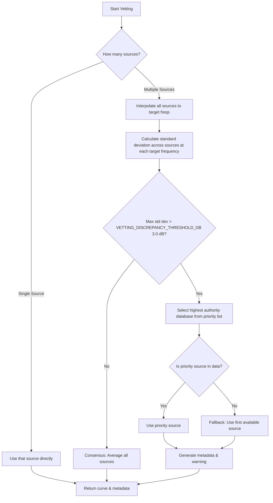

# Calibration Module Analysis: `hearing_agent/calibration_pipeline.py`

This document details how the [calibration_pipeline.py](file:///usr/local/google/home/butterworthnat/HACK/hearing/afhi-hearing-tests-public/hearing_agent/calibration_pipeline.py) module operates within the Hearing Test system.

---

## Overview

The calibration module is responsible for processing, vetting, and matching headphone frequency responses against baseline standards. It converts raw measurement curves into standardized correction offsets across standard audiometry frequencies.

The core pipeline works in three steps:
1. **Interpolation**: Logarithmic interpolation of frequency response curves to standard test frequencies.
2. **Vetting & Integration**: Combining or selecting response curves from multiple source databases (e.g., `oratory1990`, `rtings`).
3. **Correction Calculation**: Computing safe gain correction factors (in dB) bounded by safety limits.

---

## 1. Logarithmic Frequency Interpolation

### `interpolate_response`
This function projects a headphone's arbitrary measured frequency response onto standard audiometry frequencies:
`[250, 500, 1000, 2000, 3000, 4000, 6000, 8000]` Hz.

* **Logarithmic Scaling**: Since human hearing and frequency response profiles scale logarithmically, linear interpolation on raw Hz values would introduce distortions (especially in high frequencies). Instead, frequencies are transformed into $\log_{10}$ space before interpolating:
  ```python
  log_freqs = np.log10(freqs)
  log_targets = np.log10(target_freqs)
  return np.interp(log_targets, log_freqs, responses)
  ```

---

## 2. Multi-Database Vetting and Integration

### `vet_and_combine_responses`
Measurement databases can differ due to measurement fixtures and target curves. This function resolves differences when data is found in multiple databases:



### Authoritativeness and Priorities
If the measurement deviation between databases exceeds the discrepancy threshold (**3.0 dB**), the module prefers databases in this order (configured in [config.py](file:///usr/local/google/home/butterworthnat/HACK/hearing/afhi-hearing-tests-public/hearing_agent/config.py)):
1. `oratory1990` (Most authoritative / professional coupler measurements)
2. `rtings`

---

## 3. Calibration Correction Calculation

### `calculate_calibration_correction`
To calibrate the user's headphones, the system computes the difference between the baseline target and the vetted headphone curve:

$$\text{Correction} = \text{Baseline Response} - \text{User Headphone Response}$$

### Safety Clamping
To protect user hearing and prevent amplifier clipping, the correction factor is capped:
* **Max Gain boost**: $+15.0\text{ dB}$
* **Max Attenuation**: $-15.0\text{ dB}$

If any correction exceeds these limits, it is clipped, and the metadata field `clipping_occurred` is set to `True` along with diagnostic metrics showing the max clipping difference.

---

## Key Configurations Used

Referenced from [config.py](file:///usr/local/google/home/butterworthnat/HACK/hearing/afhi-hearing-tests-public/hearing_agent/config.py):

| Parameter | Value | Description |
| :--- | :--- | :--- |
| `AUDIOMETRY_FREQUENCIES` | `[250, 500, 1000, 2000, 3000, 4000, 6000, 8000]` | Frequencies tested in hearing tests. |
| `DATABASE_PRIORITY` | `['oratory1990', 'rtings']` | Authority hierarchy for source databases. |
| `MAX_CORRECTION_DB` | `15.0` | Upper limit for boost correction. |
| `MIN_CORRECTION_DB` | `-15.0` | Lower limit for attenuation correction. |
| `VETTING_DISCREPANCY_THRESHOLD_DB` | `3.0` | Standard deviation threshold for source discrepancy. |
